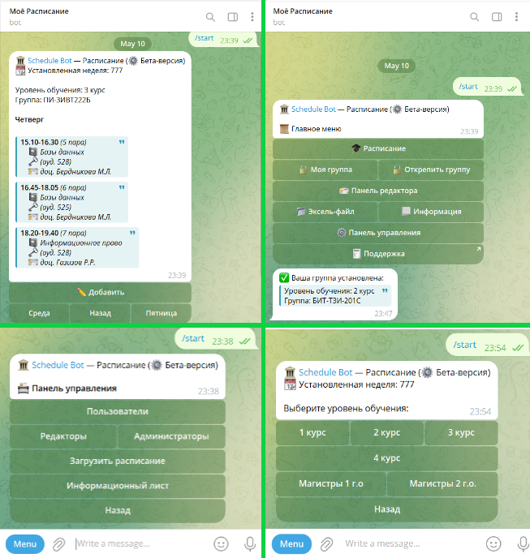
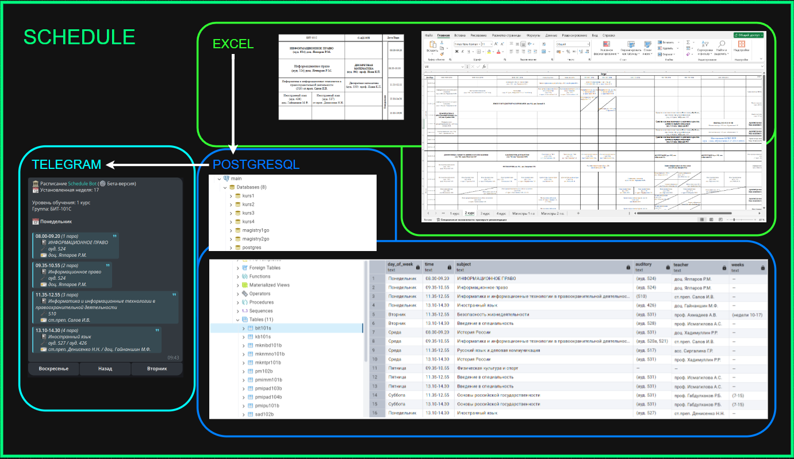

# Schedule Bot

This project was developed for educational purposes to enhance the automation of academic scheduling. It efficiently reads schedules from Excel files, organizes the data in a database, and allows students to conveniently access their timetables through Telegram, making it easier to manage their academic commitments.

## **The project through the eyes of user**



## Project work (monolith)



## Prerequisites

- Go 1.21 or higher
- Docker and Docker Compose
- PostgreSQL (if running locally)

## Project Structure

```
.
├── config/             # Configuration management
├── snschedule_bot/     # Bot implementation
├── docker/            # Docker related files
│   └── postgres/      # PostgreSQL initialization scripts
├── Dockerfile         # Application Dockerfile
├── docker-compose.yml # Docker Compose configuration
├── Makefile          # Build and development commands
├── go.mod            # Go module file
└── main.go           # Application entry point
```

## Getting Started

1. Clone the repository
2. Copy `.env.example` to `.env` and fill in your configuration
3. Run the application:

```bash
# Build and run with Docker
make docker-build
make docker-up

# Or run locally
make build
make run
```

## Development

```bash
# Build the application
make build

# Run tests
make test

# Clean build artifacts
make clean
```

## Docker Commands

```bash
# Build Docker images
make docker-build

# Start containers
make docker-up

# Stop containers
make docker-down

# Initialize database
make init-db
```

## Environment Variables

- `DB_HOST`: Database host (default: localhost)
- `DB_PORT`: Database port (default: 5432)
- `DB_USER`: Database user (default: postgres)
- `DB_PASSWORD`: Database password (default: postgres)
- `DB_NAME`: Database name (default: schedule_bot)
- `BOT_TOKEN`: Telegram bot token

## License

MIT
